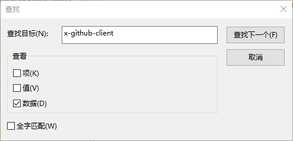

## 绑定特定的URL到桌面程序

这个功能说出来可能不太清楚，就举个例子，如果有安装Github桌面版软件，在Github仓库的<kbd>Clone or Download</kbd>按钮下面选择<kbd>Open in Desktop</kbd>选项，在弹出来的窗口里点击确定就可以直接打开Github的桌面客户端。

以上就是这种功能的具体作用，可以通过一个特殊的网址启动特定的桌面程序。

具体实现可以参照[代码]()也可以看下方的描述自行考虑实现方法

首先，实现功能前，可以先看一下Github里<kbd>Open in Desktop</kbd>选项里的地址,一般情况下应该是像下面这种的链接
> x-github-client://openRepo/https://github.com/TohckyToki/CSSamples

可以看到这个连接的url协议并不是常见的http或者https,而是x-github-client这种特殊协议

接着我们可以打开系统注册表在HKEY_CLASSES_ROOT里搜索数据为x-github-client的项目

如果有安装Github客户端的话这里应该能搜索到以下的结果

这个项目全部展开的内容如下


可以看到，这里基本就是把本地安装的exe和之前看到的特殊的协议进行了一个绑定，也就是说只要在注册表里创建一个把当前程序与一个特殊协议进行关联的项目就可以实现通过特殊网址打开本地程序的功能了。

了解到这一步，那么程序要实现的功能也就很明确了，就是向注册表里新建一个关联程序与URL的项目就好了，具体实现如下。

#### 代码实现

需要先安装操作注册表的依赖包
> dotnet add package Microsoft.Win32.Registry

``` C#
using Microsoft.Win32;
using System;
using System.Linq;

...

if (Registry.ClassesRoot.GetSubKeyNames().Where(r => r.ToLower() == "协议名称").Count() == 0)
{
    var 协议名称 = Registry.ClassesRoot.CreateSubKey("协议名称", true);
    var DefaultIcon = 协议名称.CreateSubKey("DefaultIcon");
    var shell = 协议名称.CreateSubKey("shell");
    var open = shell.CreateSubKey("open");
    var command = open.CreateSubKey("command");

    // 这里试了一下，不设置也不会有影响
    协议名称.SetValue("", "URL:协议名称");

    协议名称.SetValue("URL Protocol", "");
    // 如果只是想试试效果，图标可以使用系统的，这里使用的是画图的图标
    // DefaultIcon.SetValue("", @"%windir%\system32\mspaint.exe, 1");
    DefaultIcon.SetValue("", @"图标");
    // 这里的 %1 是从URL里传过来的参数 可以与前面的可选参数进行拼接
    // 组合成应用程序真正识别的参数
    command.SetValue("", $@"""可执行程序路径"" 可选参数 ""%1""");

    协议名称.Dispose();
    DefaultIcon.Dispose();
    shell.Dispose();
    open.Dispose();
    command.Dispose();
}

...
```
